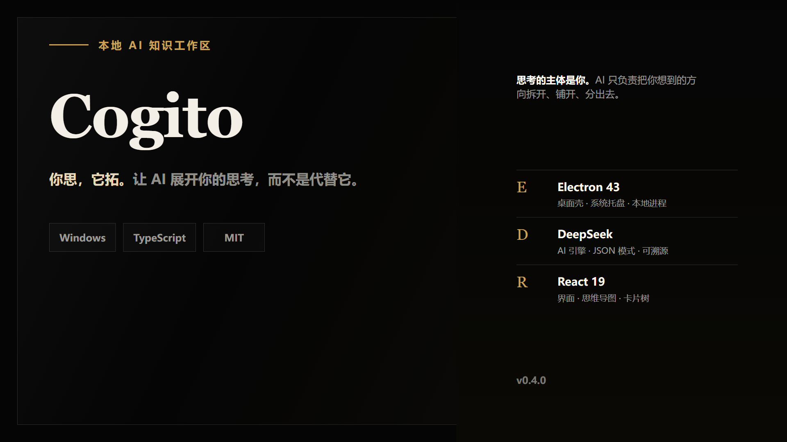
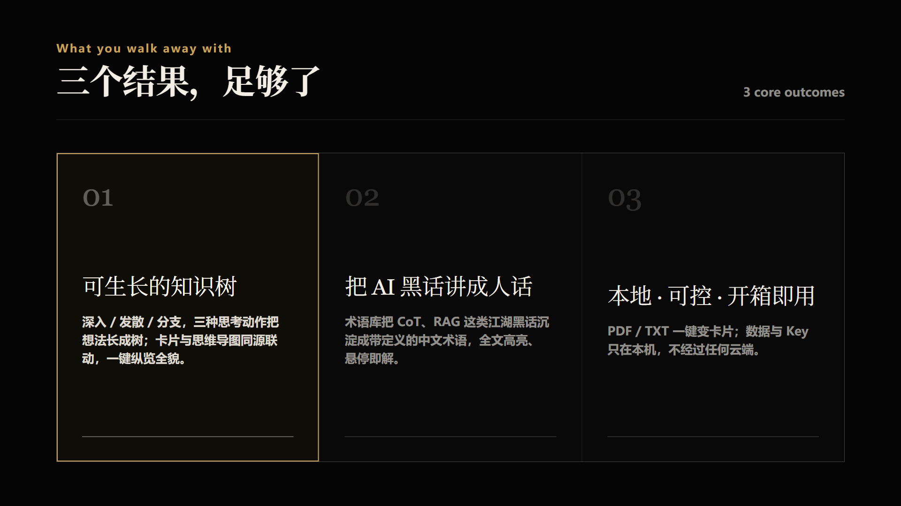

<div align="center">

# Cogito

**你思，它拓 —— 让 AI 展开你的思考，而不是代替它**



[](./LICENSE)

</div>

---

## 这是什么

Cogito 是一个**本地**运行的 AI 知识探索工作区。它以「卡片」为知识的最小单元，把零散的想法拆解、扩展成一棵可回溯的知识树。

关键在角色分工：**思考的主体始终是你**。AI 不做「你问它答」，而是做「你思它拓」——你负责选题、定方向、判断对错，AI 只负责把你想到的方向继续拆开、铺开、分出去。

## 为什么需要它

常见的 AI 问答工具是「一次性」的：问完即弃，知识无法沉淀；更隐蔽的是，**思考的主动权在不知不觉中交给了 AI**——你被答案牵引，而不是被自己的问题驱动。

Cogito 把关系反了过来：

- **你负责想**：选题、定方向、判断对错、删改重组，决定这棵树长成什么样。
- **AI 负责展开**：把「人想出来的方向」拆成语义连贯、有增量的小卡片。
- **人是最后的裁判**：AI 的输出只是草稿，每张卡片都可编辑、可推翻、可溯源。

## 你会得到什么



1. **一棵可生长的知识树** —— 深入 / 发散 / 分支三种思考动作，把想法长成树；卡片与思维导图同源联动，一键纵览全貌。
2. **把 AI 黑话讲成人话** —— 术语库把 CoT、RAG 这类江湖黑话沉淀成带定义的中文术语，全文高亮、悬停即解，**尤其利于初学者**。
3. **本地、可控、开箱即用** —— PDF / TXT 一键变卡片；数据与 Key 只存在本机，不经过任何云端。

## 工作方式

上传文档或手动建卡 → 选「深入 / 发散 / 分支」让 AI 生成子卡 → 长成一棵知识树 → 一键切换思维导图。每次生成都记录模型 / tokens / 耗时（`aiMeta`），可溯源、可重试；整树生成采用增量语义，已有子树不会被重写。

## 快速开始

**桌面版（推荐）**：从 [Releases](https://github.com/waliean/cogito/releases) 下载 `Cogito Setup x.x.x.exe` 安装，或下载便携版解压即用。

**开发模式**：

```bash
npm install        # Node 22+
npm run dev        # 后端 :3001 + 前端 :5173
npm test           # 后端 144 用例 + 前端 55 用例
```

首次使用：启动后右上角「设置」填入 DeepSeek API Key（仅本地保存，永不回传明文）。

## 文档

| 文档 | 内容 |
|---|---|
| [docs/design.md](docs/design.md) | 技术设计：数据 Schema、API 契约、状态机、Prompt、ADR |
| [docs/packaging.md](docs/packaging.md) | 桌面封装：构建、打包、验证 |
| [CHANGELOG.md](CHANGELOG.md) | 版本变更记录 |

## 许可证

[MIT](./LICENSE)

## 关于作者

Henry —— 一个相信「AI 应该放大思考，而非替代思考」的独立开发者。
